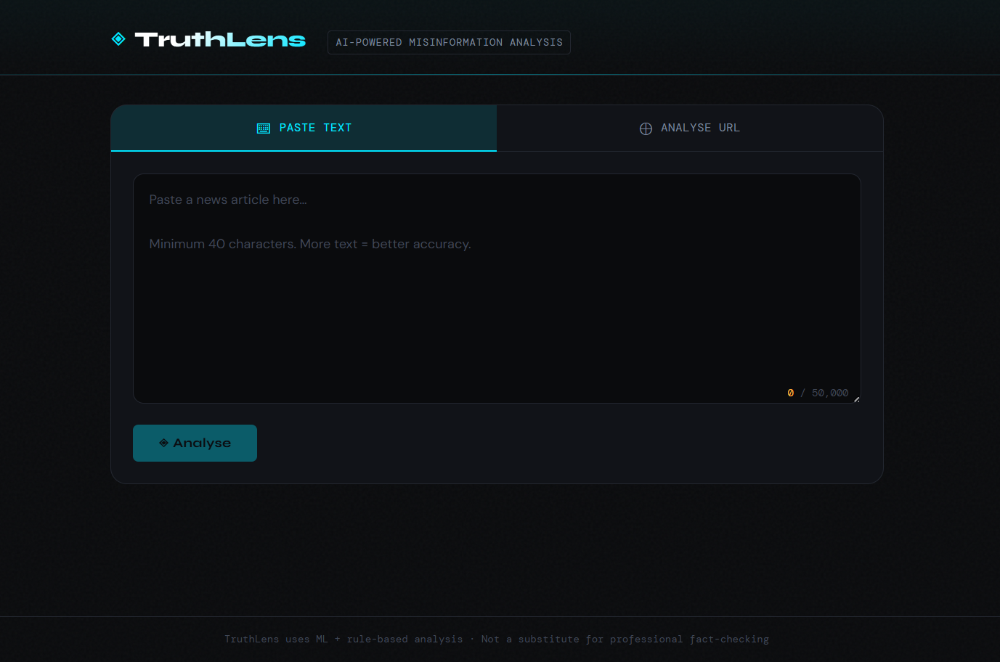

# TruthLens — Fake News Detection System

A production-quality full-stack application that classifies news articles as **REAL** or **FAKE** using machine learning, with sentence-level suspicion highlighting, confidence scoring, and domain credibility checks.

---

# UI Preview



---

## Table of Contents

1. [Project Overview](#project-overview)
2. [Architecture](#architecture)
3. [Folder Structure](#folder-structure)
4. [ML Pipeline](#ml-pipeline)
5. [How to Run Locally](#how-to-run-locally)
6. [API Reference](#api-reference)
7. [Sample Test Inputs](#sample-test-inputs)
8. [Future Improvements](#future-improvements)

---

## Project Overview

| Layer     | Technology                          |
|-----------|-------------------------------------|
| Frontend  | React 18, Vite, CSS Modules         |
| Backend   | FastAPI, Pydantic v2, Uvicorn       |
| ML Model  | scikit-learn (TF-IDF + Logistic Regression) |
| Scraping  | httpx + BeautifulSoup4              |
| Deploy    | Docker + docker-compose             |

**Key features:**
- Paste raw text or submit a URL to scrape
- REAL / FAKE verdict with confidence percentage
- Sentence-level colour-coded suspicion map (click sentences to see triggered flags)
- Rule-based explanation: sensational language, unverified sourcing, conspiracy terms, etc.
- Domain credibility check against curated trusted/untrusted lists
- Heuristic fallback mode when ML model isn't trained yet (works out of the box)

---

## Architecture

```
Browser (React)
      │  HTTP/JSON
      ▼
FastAPI backend (port 8000)
   ├── POST /api/v1/predict       → AnalysisService → ModelService
   ├── POST /api/v1/analyze-url   → ScraperService → AnalysisService → ModelService
   └── GET  /health
         │
         ├── ModelService (singleton, loads joblib artefacts)
         ├── AnalysisService (sentence scoring, explanation, domain check)
         └── ScraperService (httpx + BeautifulSoup)
```

---

## Folder Structure

```
fakenews/
├── docker-compose.yml
├── test_inputs.json           ← sample test cases
│
├── backend/
│   ├── Dockerfile
│   ├── requirements.txt
│   ├── .env.example
│   ├── main.py                ← FastAPI app factory + lifespan
│   ├── config.py              ← pydantic-settings config
│   ├── models/
│   │   ├── schemas.py         ← Pydantic request/response models
│   │   ├── fake_news_model.joblib     ← generated by train.py
│   │   └── tfidf_vectorizer.joblib   ← generated by train.py
│   ├── routes/
│   │   ├── health.py
│   │   └── predict.py
│   ├── services/
│   │   ├── model_service.py   ← ML inference singleton
│   │   ├── analysis_service.py ← full pipeline orchestration
│   │   └── scraper_service.py ← URL fetching + extraction
│   └── utils/
│       ├── text_utils.py      ← cleaning, tokenisation, sentence splitting
│       └── domain_checker.py  ← credibility lookup
│
├── frontend/
│   ├── Dockerfile
│   ├── nginx.conf
│   ├── package.json
│   ├── vite.config.js
│   ├── index.html
│   └── src/
│       ├── main.jsx
│       ├── App.jsx / App.module.css
│       ├── styles/globals.css
│       ├── hooks/
│       │   └── useAnalysis.js
│       ├── utils/
│       │   └── api.js
│       └── components/
│           ├── Header.jsx / .module.css
│           ├── Footer.jsx / .module.css
│           ├── AnalyserPanel.jsx / .module.css
│           ├── ResultPanel.jsx / .module.css
│           ├── VerdictCard.jsx / .module.css
│           ├── ConfidenceBar.jsx / .module.css
│           ├── ExplanationCard.jsx / .module.css
│           ├── HighlightedText.jsx / .module.css
│           ├── DomainBadge.jsx / .module.css
│           ├── LoadingState.jsx / .module.css
│           └── ErrorState.jsx / .module.css
│
└── ml/
    ├── requirements.txt
    ├── data/                  ← place Fake.csv and True.csv here
    └── scripts/
        └── train.py           ← end-to-end training pipeline
```

---

## ML Pipeline

### Dataset

Uses the [Kaggle Fake and Real News Dataset](https://www.kaggle.com/datasets/clmentbisaillon/fake-and-real-news-dataset).

**Download:**
```bash
pip install kaggle
# Place your API key at ~/.kaggle/kaggle.json
kaggle datasets download -d clmentbisaillon/fake-and-real-news-dataset \
  -p ml/data --unzip
```

Or download manually and place `Fake.csv` + `True.csv` into `ml/data/`.

### Preprocessing

1. Lowercase all text
2. Remove URLs, emails, mentions, hashtags
3. Remove punctuation and digits
4. Stopword removal (NLTK English)
5. WordNet lemmatisation

### Feature Engineering

- **TF-IDF** with unigram + bigram features (100k max features)
- `sublinear_tf=True` for log-normalised term frequencies
- `min_df=2`, `max_df=0.95` to filter noise and ubiquitous terms

### Model

**Logistic Regression (L2, C=5.0, lbfgs solver)**

Typical performance on the Kaggle dataset:
| Metric    | Score  |
|-----------|--------|
| Accuracy  | ~98.5% |
| Precision | ~98.4% |
| Recall    | ~98.6% |
| F1        | ~98.5% |

### Train

```bash
cd fakenews/
pip install -r ml/requirements.txt
python ml/scripts/train.py
# Model saved to backend/models/
```

---

## How to Run Locally

### Option A — Docker Compose (recommended)

```bash
# 1. Clone / extract the project
cd fakenews/

# 2. (Optional) train the model first
python ml/scripts/train.py

# 3. Start everything
docker-compose up --build

# Frontend: http://localhost:3000
# API docs: http://localhost:8000/docs
```

### Option B — Manual (no Docker)

**Backend:**
```bash
cd fakenews/backend/
python -m venv venv && source venv/bin/activate   # Windows: venv\Scripts\activate
pip install -r requirements.txt
cp .env.example .env
# Download NLTK data once:
python -c "import nltk; [nltk.download(r) for r in ['stopwords','wordnet','omw-1.4','punkt','punkt_tab']]"
uvicorn main:app --reload --port 8000
```

**Frontend:**
```bash
cd fakenews/frontend/
npm install
npm run dev        # http://localhost:3000
```

**Train the model (optional — heuristic fallback works without it):**
```bash
cd fakenews/
pip install -r ml/requirements.txt
python ml/scripts/train.py
# Restart the backend after training
```

### Environment Variables

Copy `backend/.env.example` to `backend/.env` and adjust as needed.

| Variable             | Default                            | Description                    |
|----------------------|------------------------------------|--------------------------------|
| `APP_ENV`            | `development`                      | `development` or `production`  |
| `APP_PORT`           | `8000`                             | Backend port                   |
| `ALLOWED_ORIGINS`    | `http://localhost:3000,...`        | CORS whitelist                 |
| `MODEL_PATH`         | `models/fake_news_model.joblib`    | Path to classifier artefact    |
| `VECTORIZER_PATH`    | `models/tfidf_vectorizer.joblib`   | Path to TF-IDF artefact        |
| `SCRAPE_TIMEOUT`     | `10`                               | Seconds to wait when scraping  |

---

## API Reference

### `GET /health`
```json
{ "status": "ok", "model_loaded": true, "version": "1.0.0" }
```

### `POST /api/v1/predict`
**Request:**
```json
{ "text": "Paste your news article text here..." }
```
**Response:**
```json
{
  "label": "FAKE",
  "confidence": 0.913,
  "explanation": "The article shows 91% likelihood of being fabricated...",
  "sentences": [
    {
      "text": "BREAKING: Scientists EXPOSE the SHOCKING truth...",
      "score": 0.87,
      "flags": ["Sensational language", "Excessive capitalisation"]
    }
  ],
  "domain_info": null,
  "source_url": null,
  "article_title": null
}
```

### `POST /api/v1/analyze-url`
**Request:**
```json
{ "url": "https://www.example.com/article" }
```
**Response:** same shape as `/predict`, plus `source_url` and `article_title` fields.

---

## Sample Test Inputs

See `test_inputs.json` for ready-made test cases. Quick examples:

**Fake (paste into UI):**
> BREAKING: Scientists EXPOSE the SHOCKING truth the mainstream media won't tell you! New research PROVES that drinking tap water causes mind control. Anonymous sources deep inside the government confirm this bombshell revelation. Share this before they DELETE it!

**Real (paste into UI):**
> The Federal Reserve held interest rates steady on Wednesday, as policymakers indicated they want to see further progress on inflation before making any adjustments. Fed Chair Jerome Powell said at a press conference that the central bank remains committed to returning inflation to its 2 percent target.

---

## Future Improvements

| Priority | Improvement |
|----------|-------------|
| High     | **BERT fine-tuning** — replace LR with `distilbert-base-uncased` fine-tuned on the dataset for ~99%+ accuracy and better sentence-level attention |
| High     | **Persistent prediction logging** — SQLite/PostgreSQL table storing every prediction for audit, retraining, and analytics |
| High     | **Rate limiting** — per-IP limits on `/predict` and `/analyze-url` to prevent abuse |
| Medium   | **LIME / SHAP explanations** — model-agnostic local explanations for each prediction |
| Medium   | **User feedback loop** — thumbs up/down on predictions to build labelled correction dataset |
| Medium   | **Expanded domain list** — integrate NewsGuard or Media Bias/Fact Check API for live domain scoring |
| Medium   | **Language detection** — reject or route non-English text appropriately |
| Low      | **PDF / image upload** — OCR support for scanned articles |
| Low      | **Browser extension** — highlight fake sentences inline on any news site |
| Low      | **Multilingual model** — fine-tune `xlm-roberta` for non-English fake news detection |
